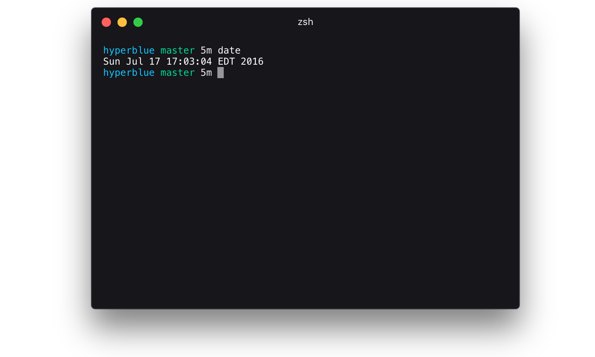

# hyperblue

> A fancy [Hyper](https://hyper.is) theme

## Install

Add `hyperblue` to the plugins list in your `~/.hyper.js` config file.

## License

MIT © [Tyler Reckart](https://tylerreckart.com)
